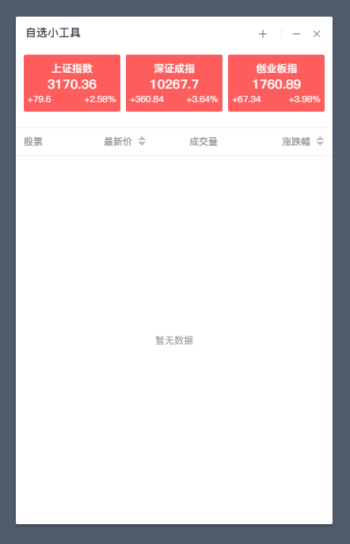

> 一款基于 electron + vue + element-ui 的实时股票股价浏览工具  
> 目前在 windows 上运行良好，除了部分已知问题  

> 如果只需要查看实时股价的话，那么这工具应该比较适合你  
> 相比在各大网站或者股票软件或者app，查看效率会比较高
  
> 如果感兴趣或者能对你有所帮助的话，可以点一下 star :)

## 功能特点
- 支持沪深港
- 支持窗口贴顶自动缩起（类似QQ）
- 映射数字+英文键，无需点击添加按钮即可快捷添加自选
- 支持自选行拖拽排序功能
- 右键点击个股可快速前往雪球或股吧查看个股
- 股票详情(部分)
- 实时K线图（不可移动查看详情）


## 程序预览


## 下载使用
> 已经发布到了 Release 中，下载后打开即可使用

## 技术栈及依赖
- electron(electron-vue)
- vue
- element-ui
- sortable-js
- mousetrap

## 开发中
- 实时K线图（移动查看详情）
- 其他功能...

## 已知 BUG
- Windows下如果调整了显示倍率（>=125%），那么拖拽顶栏时会出现无限增加宽度的问题

## 启动构建
````bash 
# 安装项目依赖
npm install

# 启动项目
npm run dev

# 构建项目
npm run build
````
